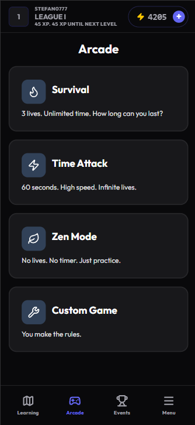
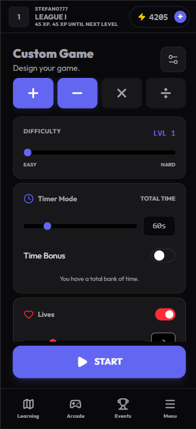
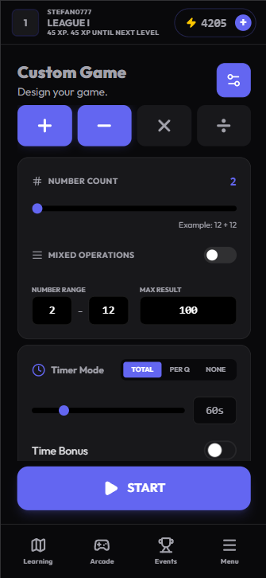
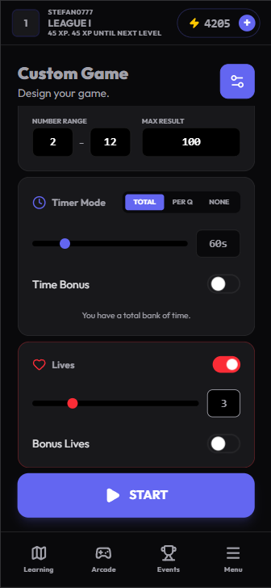
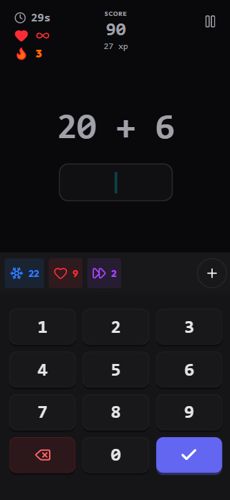
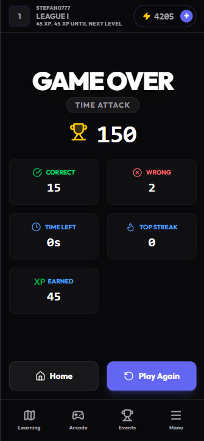
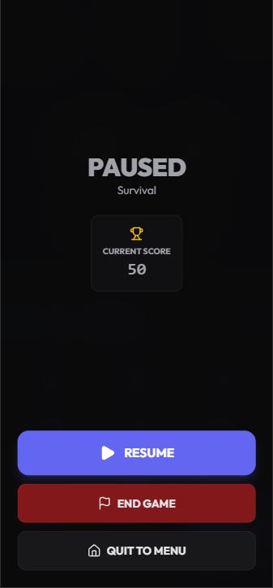
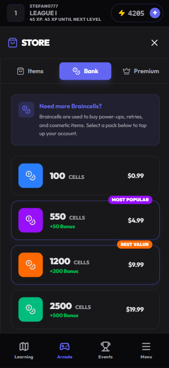
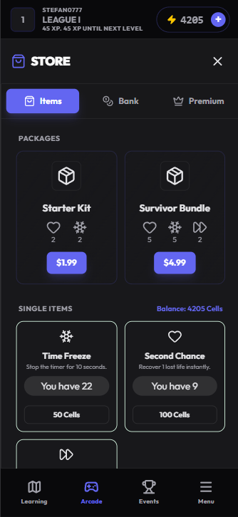
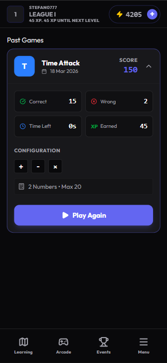

# ARITHMO - Level up your mental math

Arithmo is a math learning mobile game made for everyone. Pick your own difficulty and improve with quick games through a gamified experience.

**[🔗 Live Preview](https://stefan0712.github.io/arithmo/#)**

<p align="center">
  
  
  
  
  
  
  
</p>

---

## 🎯 The Game Idea

Arithmo is a gamified learning platform designed to strengthen math skills through quick, engaging exercises. By combining structured lessons with fast-paced arcade games, it makes practicing math addictive rather than a chore.

The experience is split into two core loops:

### 1. Learning Path (Curriculum)
Hand-crafted mini-lessons that teach math theory, mental math tricks, and foundational concepts.
* **Progressive Difficulty:** Starts from the absolute basics (great for kids or beginners) and scales up to advanced mental math.
* **Offline Ready:** 100% of the lessons are available without an internet connection.
* **Rewarding:** Completing lessons awards both Account XP and Weekly League XP to drive user retention.

### 2. Arcade Modes (Practice)
Quick, highly replayable game modes to test your reflexes and put your learning into practice.
* **Default Modes:** Play *Time Attack*, *Survival*, *Zen Mode*, or build a *Custom* configuration.
* **PvP Duels:** Challenge other players to a competitive match using a shared seed.
* **Daily/Weekly Challenges:** High-difficulty, time-gated exercises that refresh regularly and reward massive XP payouts for successful clears.

---

## 🛠️ Tech Stack & Technologies

* **Core:** React 19 & React Router
* **Game State Management:** **Zustand** (Item catalog, notifications, UI states).
* **Local-First Database:** **Dexie.js** & `dexie-react-hooks` (User data, logs, inventory, game history).
* **Animations & Polish:** **Framer Motion**
* **Styling:** **Tailwind CSS v4** with `clsx` and `tailwind-merge` for highly dynamic, state-driven styling.
* **Data Synchronization:** `bson-objectid` (Generates MongoDB-compatible unique identifiers entirely offline, prepping the local data for eventual cloud synchronization).

---

## ✨ Features

### Multiple Game Modes
The core engine powers multiple ways to play, catering to different skill levels and playstyles:
* **Survival:** Infinite time, limited lives. Test your absolute limits.
* **Time Attack:** Limited time, infinite lives. Focus on raw speed.
* **Standard:** Limited time and lives. The ultimate balanced challenge.
* **Zen:** Infinite time and lives. Stress-free practice.
* **Custom Mode:** Set your own rules by changing every single rule of the game. *Note: No XP is awarded in this mode.*

<table width="100%">
  <tr>
    <td width="25%" align="center">
      
    </td>
    <td width="25%" align="center">
      
    </td>
    <td width="25%" align="center">
      
    </td>
    <td width="25%" align="center">
      
    </td>
  </tr>
</table>

### Clean and Intuitive UI
The game screen is optimized specifically for mobile, keeping distractions to a bare minimum so you can focus entirely on the math.

* **Dynamic HUD:** The timer, life counter, and streak tracker update instantly as you play without lagging the screen.
* **Quick-Access Inventory:** Your active power-ups and items are always visible and easy to tap in a pinch.
* **Custom Numpad:** A built-in, oversized number pad removes the friction of dealing with a clunky default phone keyboard.
* **Match Summaries:** Get a clean breakdown of your speed, accuracy, and total XP earned the second the round ends.

<table width="100%">
  <tr>
    <td width="33%" align="center">
      
    </td>
    <td width="33%" align="center">
      
    </td>
    <td width="33%" align="center">
      
    </td>
  </tr>
</table>

### Player Engagement & Retention
To keep players coming back, the game relies on two main systems: an active economy and detailed performance tracking.

#### The In-Game Economy
* **Power-Up Items:** *Time Freeze*, *Extra Life*, and *Skip Exercise* give players a tactical edge when the timer gets tight. They can be bought in the shop using virtual or real currency.
* **Brain Cells:** The main digital currency. You earn Brain Cells simply by playing the game, completing daily challenges, or receiving gifts.

#### Advanced Game Analytics (Work-in-Progress)
A dedicated dashboard meant to help players actually see their math skills improving over time.
* [x] **Match History:** View past games and the exact custom configurations used.
* [x] **Quick Replay:** One-click replay of old game configs to try and beat your previous score.
* [ ] **Stat Breakdowns:** Detailed insights showing exactly which math operations or specific exercises took the longest to answer.
* [ ] **Self-PvP:** Play against a "ghost" replay of your own past games, simulating a live 1v1 race against yourself.

<table width="100%">
  <tr>
    <td width="33%" align="center">
      
    </td>
    <td width="33%" align="center">
      
    </td>
    <td width="33%" align="center">
      
    </td>
  </tr>
</table>

---

## 🏗️ How It Works Under the Hood

Arithmo is designed to feel like a native mobile app and run smoothly even if you have a terrible internet connection. I used Tailwind CSS and Framer Motion to keep the design clean, minimal, and snappy.

### 1. The Offline-First Economy
Instead of making the player stare at a loading spinner every time they do something, the game processes almost everything locally using Dexie (IndexedDB) and verifies it with the backend later.

* **Buying & Using Items:** When a user buys an item, the game checks their local balance, deducts the credits, and instantly adds the item to their inventory so they can keep playing. It then drops a record of this into a local `syncQueue`. A background worker silently tries to push this queue to the API whenever the connection is good.
* **Awarding XP & Anti-Cheat:** XP is calculated based on difficulty multipliers and active boosts. Because everything runs locally, a player could theoretically cheat to give themselves millions of XP. To prevent this, the backend recalculates and verifies the math before officially saving the XP to the cloud database.
* **Real Currency Exception:** The only thing that isn't offline-first is buying premium currency. The backend completely handles these payments to ensure security, returning a success/fail message before updating the local game.

### 2. The Universal Game Engine
Instead of writing separate code for every single game mode, I built one main `useGameEngine` hook that runs everything based on a "config" file.

* **How it works:** Whether you are playing the default Survival mode or a custom game, the engine just reads the config (timers, lives, operations) and a `createExercise` function spits out math problems that match those rules.
* **Anti-Farming:** Because the custom mode lets you make the game incredibly easy (like giving yourself infinite time to answer `1+1`), custom games are strictly for practice and do not award XP.
* **State Management:** The engine handles the active timer, lives, and item usage instantly, updating the local database on the fly so your inventory is always accurate mid-game.

### 3. "Ghost" Multiplayer (Asynchronous PvP)
Real-time multiplayer is incredibly complex and prone to lag. To make multiplayer fast and fair on mobile, Arithmo uses an asynchronous "Ghost" system.

* **The Setup:** Player 1 initiates a duel. The backend generates a specific "seed" for that match.
* **The Ghost Run:** Player 1 plays their round. Because of the seed, the game generates a specific sequence of math problems. The app records exactly what Player 1 answered and at what exact timestamp.
* **The Duel:** When Player 2 accepts the invite, the game uses the same seed to generate the exact same math problems. Player 2 then plays against a "ghost" of Player 1's recorded actions, giving the illusion of a live, side-by-side race.
* **Fair Play:** To keep it purely skill-based, standard inventory items are disabled in multiplayer. Instead, both players get exactly one "Free Skip" item to use strategically during the match.

## 📱 How to Install (Play on Mobile)

Arithmo is built as a **Progressive Web App (PWA)**. For the best experience, you can install it directly to your phone's home screen so it runs exactly like a native app (full screen, no browser bars, and offline support).

**On iOS (iPhone/iPad):**
1. Open the [Live Preview link](https://stefan0712.github.io/arithmo/#) in **Safari**.
2. Tap the **Share** button at the bottom of the screen (the square with an arrow pointing up).
3. Scroll down and tap **"Add to Home Screen"**.

**On Android:**
1. Open the [Live Preview link](https://stefan0712.github.io/arithmo/#) in **Chrome**.
2. Tap the **Menu** icon (three dots in the top right corner).
3. Tap **"Install App"** or **"Add to Home Screen"**.

---

## 💻 Running Locally for Development

If you want to clone the repo and run the game locally, follow these steps:

### Prerequisites
* **Node.js** (v18.0.0 or higher recommended)
* **npm** or **pnpm**

### Setup

Clone the repository:
```bash
git clone https://github.com/stefan0712/arithmo.git
```

Navigate to the project directory:
```bash
cd arithmo
```

Install dependencies:
```bash
npm install
```

Start the development server:
```bash
npm run dev
```
Open http://localhost:5173 in your browser. For the best testing experience, use your browser's DevTools (F12) and toggle the Device Toolbar (Ctrl+Shift+M) to simulate a mobile screen.

## 👤 Author & License

**Stefan Vladulescu**
* **Portfolio:** [stefanvladulescu.com](https://stefanvladulescu.com)
* **GitHub:** [@stefan0712](https://github.com/stefan0712)

Distributed under the **MIT License**. See the `LICENSE` file for more information.